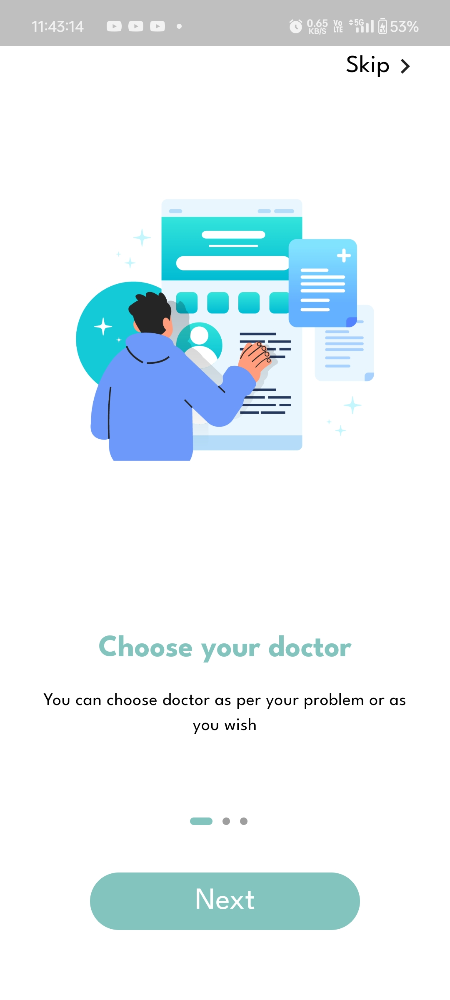
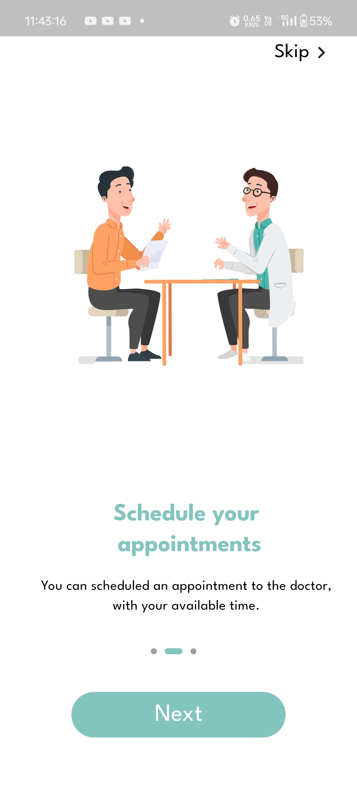
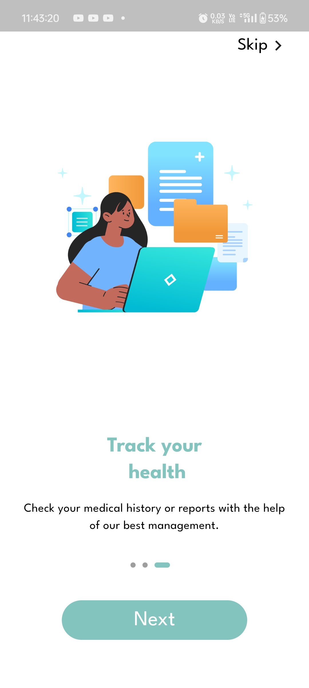
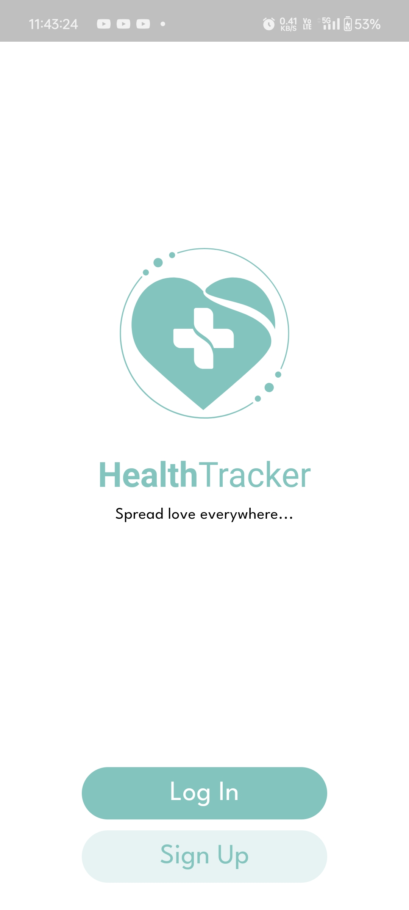
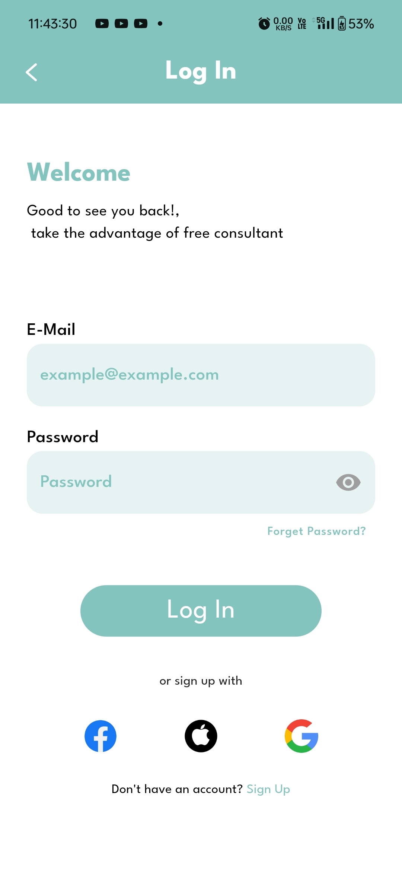
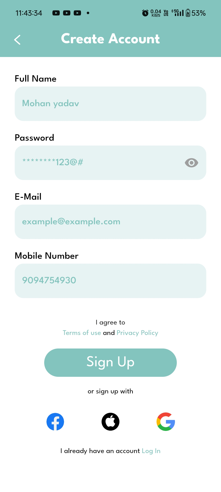

# health_tracker

### A Project that can help you to maintain your health in simple steps.

A modern healthcare app designed to streamline patient management, enhance doctor-patient
communication, and offer personalized health insights. Perfect for clinics, hospitals, and
individual users seeking better health management tools.

## ScreenShoots

Here’s a preview of the HealthCarePro app:

* Simple Splash Screen.*

* Choose your Doctor*

* Seamless appointment scheduling and management.*

* Track your health.*

*Detailed health insights and analytics for users.*

*User-friendly home screen with quick access to key features.*

## Features
- **Appointment Scheduling:** Easy scheduling with reminders for patients and doctors. (Not Implemented)
- **Health Insights Dashboard:** Visualize health data trends. (Not Implemented)
- **Secure Messaging:** Encrypted communication between patients and healthcare providers.  (Not Implemented)
- **Personalized Health Tips:** AI-driven health improvement suggestions. (Not Implemented)

## Technologies Used
- **Frontend:** Flutter
- **Backend:** SpringBoot  (Not Implemented)
- **Database:** MongoDB  (Not Implemented)
- **APIs:** OpenAI for health insights, Twilio for messaging  (Not Implemented)
