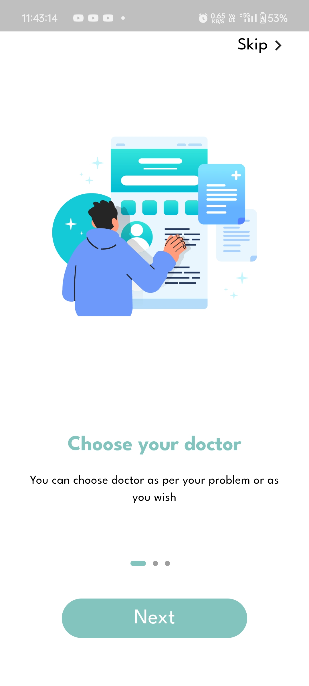
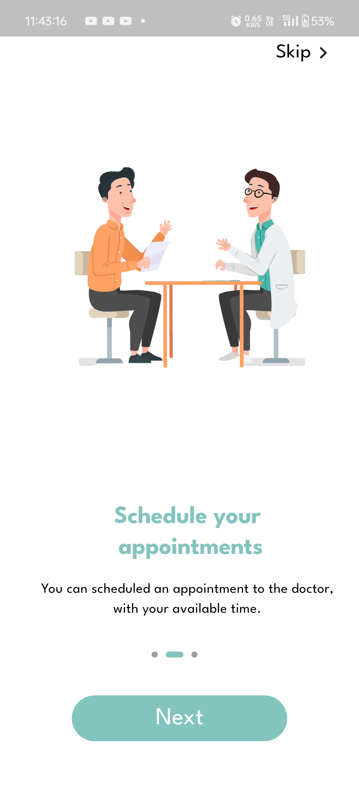
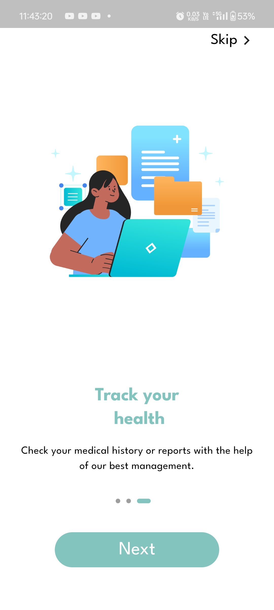
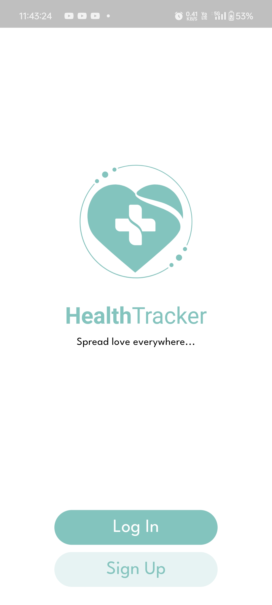
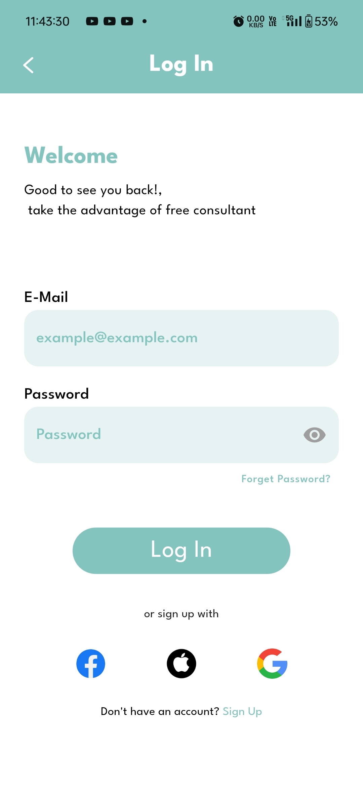
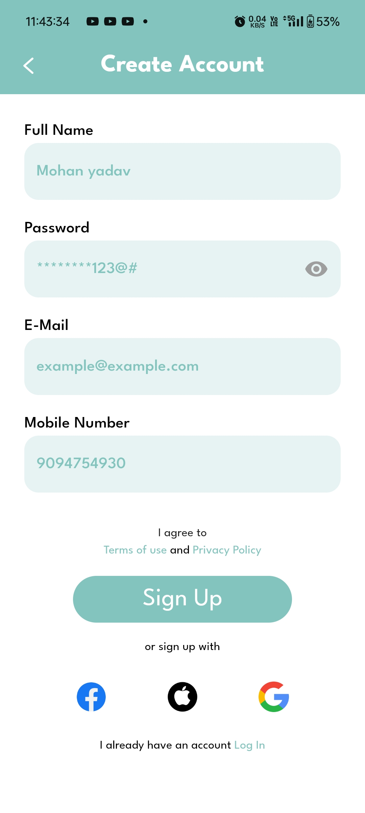

# health_tracker

### A Project that can help you to maintain your health in simple steps.

A seamless platform for booking doctor appointments, featuring real-time chat for consultations, doctor profiles, and appointment management. Users can explore pharmacy stores, save favorite doctors, and receive notifications. Secure authentication with Firebase ensures a safe and reliable experience. 🚀

## ScreenShoots

Here’s a preview of the HealthCarePro app:

*Simple Splash Screen.*

*Choose your Doctor*

*Seamless appointment scheduling and management.*

*Track your health.*

*Detailed health insights and analytics for users.*

*User-friendly home screen with quick access to key features.*

## Features
🏥 **Doctor Profiles** – View doctor details, specialties, and availability

📅 **Appointment Booking** – Schedule and manage appointments easily

💬 **Chat** – Secure messaging with doctors

🔐 **Firebase Authentication** – Secure login and user management

📌 **Notifications – Appointment** reminders and updates

🌐 **Online & Offline Access** – Smooth experience even with low connectivity

💊 **Pharmacy Stores** – Browse nearby pharmacies

⭐ **Favorite Doctors** – Save preferred doctors for quick access

## Technologies Used
- **Frontend:** Flutter
- **Backend:** Firebase 
- **Database:** MongoDB  (Not Implemented)
- **APIs:** OpenAI for health insights, Twilio for messaging  (Not Implemented)
